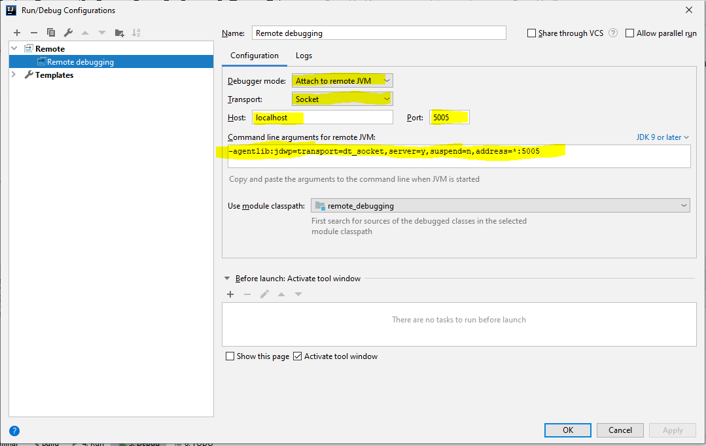

This code is a sample code for debugging remotely any java application.
I have taken Spring application for testing it.

Command to run the application in remote server(for java 9-12)
------------
mvn spring-boot:run -Dspring-boot.run.jvmArguments="-agentlib:jdwp=transport=dt_socket,server=y,suspend=n,address=*:5005"

Connected to the Remote application using Intellij
------------------------
1. Open configuration box
2. Select "Remote" option
3. Fields will be added by default as follows

